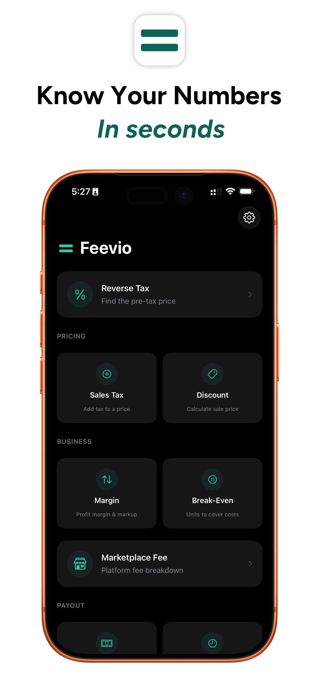
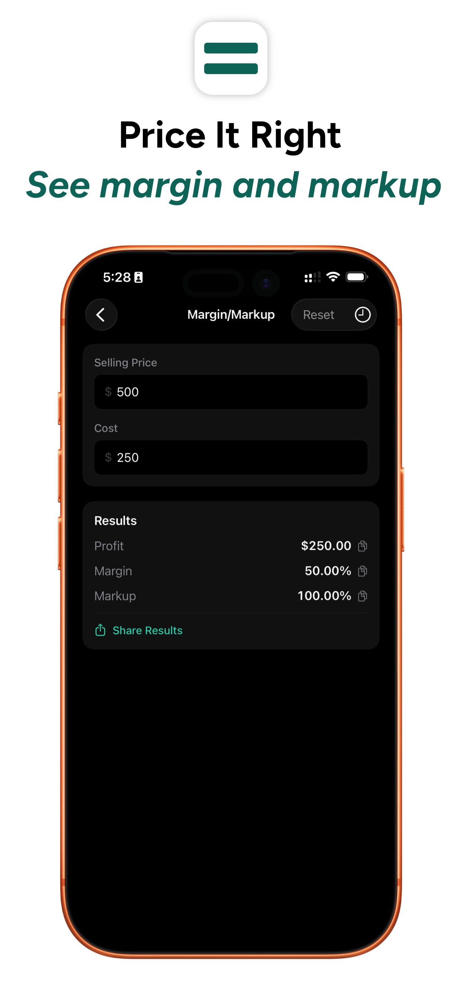
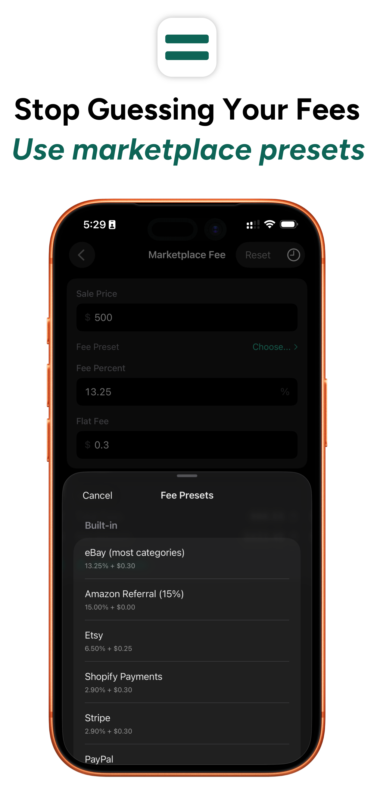
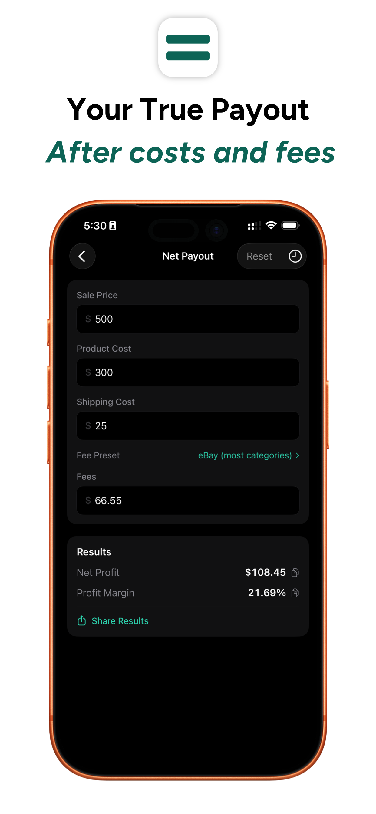
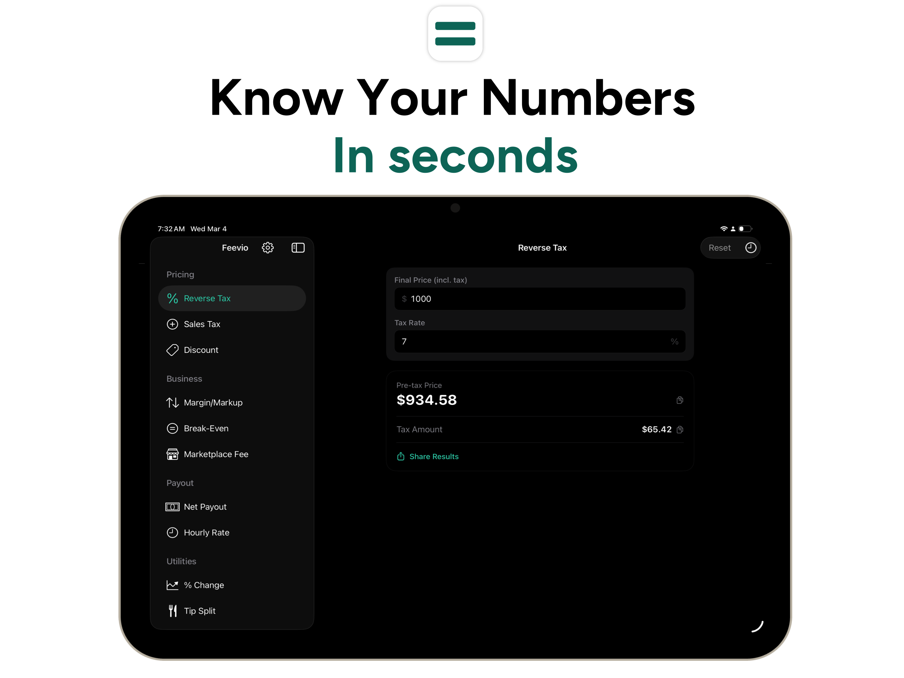

  

# Feevio

A small business calculator toolkit for iOS and Apple Watch — ten essential financial calculators in one clean, fast app.

## Screenshots

### iPhone

  
  
  
  

### iPad & Apple Watch

  
  

## Calculators

- **Reverse Tax** — Find the pre-tax price from a tax-inclusive total
- **Sales Tax** — Calculate tax amount and total from a pre-tax price
- **Discount** — See the final price and savings after a percentage discount
- **Margin vs Markup** — See profit margin and markup side by side, with overhead folded into your cost basis
- **Break-Even** — Calculate how many units you need to sell to cover your fixed costs and overhead
- **Marketplace Fee** — Compute platform fees and your net amount
- **Net Payout** — Get your true profit after costs, shipping, fees, and overhead
- **Hourly Rate** — Find the hourly rate you need to hit your income goal
- **% Change** — Calculate the percentage increase or decrease between two values
- **Tip Split** — Split a bill with tip evenly among a group

## Features

- Real-time calculations as you type
- Overhead input to factor labor, packaging, and fixed costs into Margin/Markup, Net Payout, and Break-Even — as a flat dollar amount or a percentage
- Side-by-side comparison mode for "what if" scenarios (premium)
- Save and recall favorite calculations (premium)
- Interactive sliders for quick adjustments
- Built-in fee presets for eBay, Amazon, Etsy, Shopify, Stripe, and PayPal
- Custom fee presets you can save and reuse
- Copy any result to clipboard with one tap
- Calculation history (premium)
- Apple Watch companion app with 6 calculators, including overhead on Margin/Markup (premium)
- Inputs persist between sessions
- Configurable default tax rate
- iPad-optimized layout with sidebar navigation
- Full dark mode support

## Premium

Feevio is free to use with ads. A one-time in-app purchase removes ads and unlocks premium features including calculation history, saved scenarios, comparison mode, and the Apple Watch companion app.

## Requirements

- iOS 17.0+
- watchOS 10.0+ (companion app)

## Privacy

Feevio does not collect or share any of your personal data. Ad serving is handled by Google AdMob. See our full [Privacy Policy](PRIVACY.md).

## Support

Have a question or found a bug? Check our [Support & FAQ](SUPPORT.md) page or [open an issue](https://github.com/idevtim/feevio/issues).

## License

All rights reserved.
